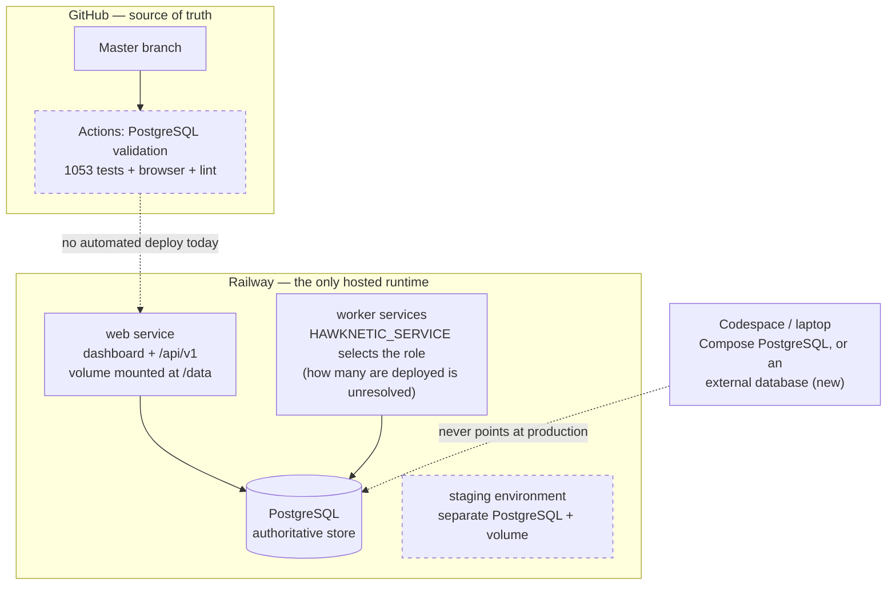

# Current infrastructure

What this project is, what runs it today, and which parts of that are
established fact rather than inference.

## Evidence status

This audit was performed from the repository with a working runtime: the full
suite, migrations, lint, the wheel build, and the browser checks were all run
and all pass. It was **not** performed with Railway, Cloudflare, Neon, or Render
credentials, because none were available to the session.

So everything below is one of three kinds of claim, and they are labelled:

- **Measured** — observed directly in this session.
- **Recorded** — taken from a dated document in this repository.
- **Unverified** — cannot be settled without account access. `scripts/railway_inventory.sh`
  settles most of these in one command.

Two recorded claims already contradict each other; see [Unresolved](#unresolved).

## The application

One Python package, `kalshi_research_bot`, ~37,000 lines across 100 modules.
There is no JavaScript application, no package manager workflow, and no
frontend build. (Measured.)

| Property | Value |
| --- | --- |
| Language | Python 3.12 (`runtime.txt`, `requires-python`) |
| Runtime dependencies | `psycopg[binary]`, `psycopg_pool` — that is all |
| Build | Nixpacks on Railway; setuptools wheel elsewhere |
| Database | PostgreSQL only. 16 forward-only SQL migrations in `migrations/postgres/` |
| Web framework | None. `paper_server.py` is a stdlib HTTP server |
| Frontend | Server-rendered HTML plus 160 KB of static assets shipped in the wheel |
| Queue / cache / Redis | None. The `ops` schema in PostgreSQL is the coordination layer |
| Tests | 1053, ~112 s against a real PostgreSQL |

The dashboard and `/api/v1` are served by the same process. Roles are selected
at start by `HAWKNETIC_SERVICE`: `web`, or one of eight workers.

### Workloads

| Component | Class | Cadence | Always-on today |
| --- | --- | ---: | --- |
| `web` dashboard + `/api/v1` | HTTP API + server-rendered UI | continuous | yes |
| `kalshi-market-ingestion` | Data ingestion | 300 s | yes |
| `external-source-ingestion` | Scraper / ingestion | 900 s | yes |
| `crypto-research` | Batch modelling | 900 s | yes |
| `sports-research` | Batch modelling | 3600 s | yes |
| `research-model-refresh` | Batch modelling | 3600 s | yes |
| `settlement-worker` | Scheduled reconciliation | 3600 s | yes |
| `raw-retention` | Scheduled maintenance | 3600 s | yes |
| `reporting-evaluation` | Scheduled reporting | 21600 s | yes |
| PostgreSQL | Database | continuous | yes |

(Cadences measured from `worker_services.SERVICE_SPECS`.)

Every worker is an always-on process whose own `WorkerSpec` loop provides the
schedule. **Five of the eight run hourly or slower.** A worker on the 6-hour
cadence is resident for 21,600 seconds to do a few seconds of work, and Railway
meters memory for every one of those seconds. That is the single clearest
inefficiency in the current design, and it is what `HAWKNETIC_SERVICE_MODE=once`
now makes fixable.

### Measured process footprint

| Process | Resident set after import |
| --- | ---: |
| Bare Python 3.12 interpreter | 9.2 MB |
| Worker stack loaded | 25.8 MB |
| `paper_server` (web role) loaded | 27.2 MB |

These are import-time floors, not steady state. A cycle that fetches and parses
source payloads, plus a connection pool of up to `DATABASE_POOL_MAX_SIZE` (5),
raises the working set well above this. Treat 60–120 MB per running service as
the planning range and the floors above as the hard lower bound.

## Provider map

### Railway

Railway is the only hosted runtime. Recorded facts, with dates:

- Production volume mounted at `/data`, **778.44 MB used of 5,000 MB**, attached
  only to the production web service (`docs/railway-volume-storage-audit.md`,
  2026-07-25).
- Staging PostgreSQL volume at `/var/lib/postgresql/data`, **341.11 MB of
  5,000 MB** (same document).
- On 2026-08-03 the production service had **no active repository source and no
  PostgreSQL binding** (`docs/railway-postgresql-deployment-and-rollback.md`).
- Because production is not connected to the repository, neither its
  config-as-code nor its pre-deploy migration is applied, so **a merged
  migration reaches the database only when someone applies it by hand**
  (`docs/railway-worker-services.md`, `docs/schema-migration-application.md`).

Volumes are billed on provisioned-but-used storage, so 778 MB is roughly
$0.12/month — the volume is not a cost problem. It does, however, pin the web
service to a single replica.

What the `/data` volume actually holds is generated reports, feature/label CSVs
and JSON payload snapshots (traced through `config.repo_path`). PostgreSQL is
the authoritative store — `DASHBOARD_PAYLOAD_SOURCE=postgres`, and the dashboard
reads `raw.source_payloads`. The volume content is therefore mostly
*reconstructable* rather than authoritative, but the repository's own audit
records classification as **pending**, so nothing on it should be deleted on the
strength of this document.

### Cloudflare, Neon, Render

None of the three hosts anything, in production or anywhere else. There is no
`wrangler.toml`, no `render.yaml`, no configured provider hostname, and no
provider-specific connection handling. (Measured — a repository-wide search for
provider hostnames returns no configured endpoint.)

They are named in the tree, and the distinction matters in a document whose
purpose is to separate fact from inference: `scripts/local.sh` and `.env.example`
mention Neon as an optional managed *development* database, and `scripts/local.sh`
and `README.md` mention Render only as a host the local workflow refuses to run
tests against. Both are guidance and guards, not deployments.

### GitHub

`\.github/workflows/ci.yml` — "PostgreSQL validation" — is genuinely thorough,
and more rigorous than most projects this size:

- Migrations applied from empty, then repeated to prove idempotence
- Concurrent-migration serialization
- Ruff (Pyflakes rules only, deliberately)
- Wheel build
- Compose config validation
- `.env.example` ↔ `docs/environment-variables.md` inventory consistency
- An assertion that CI holds **no** Railway credentials
- Startup and protected-endpoint smoke tests
- Full Codespaces workflow, dashboard boot, `/healthz` and `/readyz` probes
- 40 browser role/state/width checks with artifacts

What it did **not** have before this change: any deployment step, any dependency
vulnerability scanning, and any secret scanning.

## Security posture

Audited this session. No committed secrets were found.

| Check | Result |
| --- | --- |
| Credentials in tracked files | None. `.env.example` holds placeholders only |
| `.env`, `*.pem`, `*.key` in history | Never committed (only `.env.example`) |
| Hardcoded provider hostnames | None |
| Session cookies | `HttpOnly`, `SameSite=Strict`, `Secure` when hosted |
| CSRF | Separate non-`HttpOnly` token cookie, `SameSite=Strict` |
| Default bind address | `127.0.0.1`; `0.0.0.0` only in the hosted role |
| Hosted auth | `DASHBOARD_REQUIRE_AUTH_WHEN_HOSTED=true` |
| Execution safety | `RESEARCH_ONLY=true`, live execution/auto-trade/upload all default false |
| Dependency scanning | **Was missing.** Added in `security.yml` |
| Secret scanning | **Was missing.** Added in `security.yml` |

The research-only posture is enforced in CI as required environment, not merely
documented.

## Unresolved

These cannot be closed from the repository. Run `scripts/railway_inventory.sh`.

1. **Which workers are deployed.** `docs/railway-worker-services.md` records that
   production runs only `web` and `kalshi-market-ingestion`.
   `docs/sports-data-upload.md` records `SportsResearchProduction`,
   `RawRetentionProduction` and `SettlementWorkerProduction` running, with five
   consecutive hourly cycles tabulated. Both cannot be true. This drives the cost
   estimate more than any other single fact, which is why the estimate below is a
   range rather than a number.
2. **Whether the staging environment is still running.** A staging PostgreSQL with
   its own volume is recorded. If it is always-on it is plausibly the largest
   single line on the bill, and it is the first thing to check.
3. **Actual metered usage.** Railway reports per-service usage in the dashboard.
   Nothing in the repository can substitute for reading it.
4. **Whether production is still disconnected from the repository.** Recorded as
   true on 2026-08-03. If still true, no merge has deployed itself since.

## Estimated current cost

Railway rates: **$20/vCPU/month, $10/GB RAM/month, $0.15/GB-month volume,
$0.05/GB egress**, metered per second except egress and storage. Hobby is $5/month
including $5 of usage; Pro is $20/seat including $20.

Because item 1 above is unresolved, both readings are priced:

| Line | If all 8 workers run | If only web + kalshi run |
| --- | ---: | ---: |
| Worker memory | ~0.64 GB → $6.40 | ~0.08 GB → $0.80 |
| Web memory | ~0.15 GB → $1.50 | $1.50 |
| PostgreSQL memory | ~0.25 GB → $2.50 | $2.50 |
| CPU (I/O-bound, bursty) | ~0.15–0.4 vCPU → $3–8 | ~0.05–0.1 vCPU → $1–2 |
| Volume (0.78 GB) | $0.12 | $0.12 |
| Egress | $0.05–0.25 | $0.05–0.25 |
| **Resource subtotal** | **~$14–19/month** | **~$6–7/month** |
| Plus a staging environment, if running | +$5–10 | +$5–10 |

Add the plan fee, less its included credit. **A realistic total today is $5–30/month**,
and the width of that range is itself the finding: it is set by unresolved items 1
and 2, not by measurement error.

## Where the money actually goes

Sorted by what a change would be worth, largest first:

1. **A staging environment left running.** Potentially the biggest line, and pure
   waste when idle. Verify first.
2. **Five hourly-or-slower workers held resident.** ~$4/month of memory bought to
   sleep. Fixable now with `HAWKNETIC_SERVICE_MODE=once`.
3. **CPU during collection cycles.** Real work; not waste. Do not optimise this by
   collecting less.
4. **PostgreSQL.** Small and load-bearing. See `TARGET_INFRASTRUCTURE.md` for why
   moving it to Neon would cost *more*, not less.
5. **Volume and egress.** ~$0.15/month combined. Ignore.
