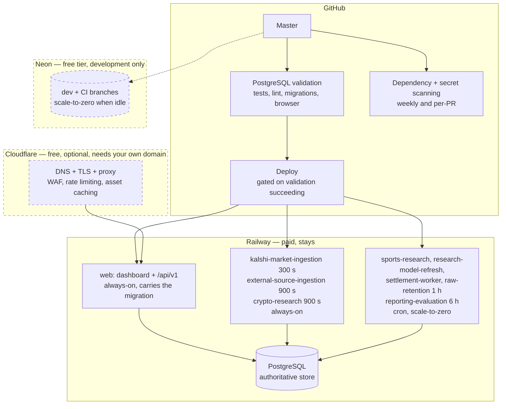

# Target infrastructure

The decision for each provider, the evidence behind it, and what stays exactly
as it is.

## Summary

**Railway remains the application platform.** Nothing moves off it. The change is
that five workers stop being always-on containers and become scheduled ones.

## Railway — keep, and keep most of it

**Decision: Railway stays as the application platform and the production database.**

The workload is a conventional long-running Python service with native
dependencies (`psycopg[binary]`), a mounted volume, processes that run for
minutes, and a database it holds pooled connections to. That is exactly what
Railway is for and exactly what edge runtimes are not.

Railway's per-second metering also suits this shape better than flat per-instance
pricing: nine mostly-idle services cost what they use, not nine instance fees.
That single fact decides the Render question below.

### The one change: schedule the slow workers

Five of the eight workers run hourly or slower. Held resident they cost roughly
$4/month of memory to sleep. As Railway cron services they cost their execution
time, which is under 2% of that.

| Worker | Cadence | Target | Why |
| --- | ---: | --- | --- |
| `kalshi-market-ingestion` | 300 s | **always-on** | 288 starts/day; container boot would be a real fraction of the cycle, and it is the primary collector |
| `external-source-ingestion` | 900 s | **always-on** | Saves ~$0.80/month as cron; not worth 96 daily cold starts yet |
| `crypto-research` | 900 s | **always-on** | Same |
| `sports-research` | 1 h | **cron** | 24 runs/day, seconds of work each |
| `research-model-refresh` | 1 h | **cron** | Same |
| `settlement-worker` | 1 h | **cron** | Same |
| `raw-retention` | 1 h | **cron** | Maintenance; the most obviously schedulable of the set |
| `reporting-evaluation` | 6 h | **cron** | 4 runs/day. Resident 21,600 s per few seconds of work |

The mechanism is `HAWKNETIC_SERVICE_MODE=once`, which runs one cycle and exits.
The cutover is safe because `run_worker_once` claims a cadence-derived
idempotency key: if a cron service and a still-running loop worker overlap, the
second records `skipped_duplicate` instead of collecting twice. Verified against
a real database, not only in tests.

Set the Railway cron schedule to match the cadence the worker already assumed —
`0 * * * *` for the hourly four, `0 */6 * * *` for reporting.

### Also worth doing on Railway

- **Connect production to the repository.** Recorded as disconnected since
  2026-08-03. Until it is connected or `deploy.yml` is wired up, a merged
  migration reaches the database only when someone applies it by hand. This is a
  correctness problem, not a cost one.
- **Point every worker service at `railway.worker.json`**, as
  `docs/railway-worker-services.md` already prescribes, so a worker does not run
  the web service's pre-deploy migration.
- **Settle the staging environment.** If it is idle, it is likely the largest
  line on the bill. Ephemeral Neon branches (below) replace what it was for in
  development.

## Neon — yes, but only for development

**Decision: use Neon for development and CI databases. Do not move production.**

### Why production must not move

Neon bills compute by the CU-hour and saves money by suspending an idle database.
This workload never lets it idle.

`kalshi-market-ingestion` runs every **300 seconds**. Neon's scale-to-zero
suspends after **5 minutes** of inactivity. The collector's cadence is exactly
the suspend threshold, so the database is woken again at or before the moment it
would sleep. The mechanism that makes Neon cheap cannot engage here — and this
holds regardless of the other seven workers, any of which would also keep it
awake.

Pricing that out at Neon's minimum autoscaling size of 0.25 CU:

| | Neon Launch, never idle | Railway PostgreSQL |
| --- | ---: | ---: |
| Compute | 0.25 CU × 730 h × $0.106 = **$19.35/mo** | ~0.25 GB RAM → **~$2.50/mo** |
| Storage | ~1 GB × $0.35 = $0.35/mo | 0.78 GB × $0.15 = $0.12/mo |
| **Total** | **~$19.70/month** | **~$2.62/month** |

Migrating production to Neon would cost roughly **$17/month more**, add a network
hop between application and database, and introduce cold-start latency on any
request that did catch it suspended. The free tier does not rescue this either:
0.25 CU running continuously consumes 182 CU-hours/month against a 100 CU-hour
allowance, exhausting it around day 16.

**Do not migrate the database.** Not because migration is hard, but because it is
five to seven times more expensive for this access pattern.

### Where Neon does win

A development database is idle almost all the time — which is precisely the shape
scale-to-zero is designed for. An engineer actively working perhaps two hours a
day uses ~15 CU-hours/month at 0.25 CU, comfortably inside the free 100.

This is also the cleanest way to finish removing local Docker: `scripts/local.sh`
now accepts `HAWKNETIC_DATABASE_URL` and `HAWKNETIC_TEST_DATABASE_URL`, so two
Neon branches replace the Compose service with no daemon on the machine at all.
Branching gives each feature branch a disposable copy of the schema.

Keep `compose.yml`. It is the offline fallback, it is what CI uses, and deleting
it would trade one hard dependency for another.

## Cloudflare — DNS and edge protection only

**Decision: use Cloudflare in front of the Railway web service. Do not host anything on it.**

Worth doing, at no cost: DNS, TLS, WAF, rate limiting on the login endpoint,
bot filtering, and origin hiding. For a dashboard exposed to the internet behind
a password, rate limiting on `/login` is the single most valuable thing on this
list.

**Requires a domain you own.** Cloudflare cannot proxy a `*.up.railway.app`
hostname. If there is no custom domain, this is the one prerequisite; everything
else here is independent of it.

**Do not move the frontend to Pages or Workers.** There is no frontend to move.
The dashboard is server-rendered HTML from the same Python process that serves
`/api/v1`, and the entire static payload is **160 KB** — `app.css`, `app.js`,
two woff2 faces, shipped inside the wheel. Splitting 160 KB onto a second
provider would add a deploy pipeline, a CORS and CSP surface, and a cache
invalidation problem, to save a few milliseconds on assets that are already
cached by the browser and can be cached at Cloudflare's edge anyway without
moving them.

Workers are also the wrong runtime for every backend component here: they cannot
run `psycopg` native builds, hold pooled PostgreSQL connections, or run
multi-minute collection cycles.

## Render — no

**Decision: do not use Render. Zero Render services in the target architecture.**

Answering the required questions directly:

- **Why Render?** No reason found.
- **Why not Railway?** Railway already runs this correctly and meters per second.
- **How much does it save?** Nothing — it costs more. Render prices always-on
  services at a flat **$7/month each**. The five always-on services here (web
  plus three hot workers plus a database) would be roughly **$35/month** before
  the database, against $6–19/month of metered Railway usage for the same shape.
  Render's $1/month cron jobs are cheap in isolation but land at $5/month for the
  five scheduled workers, where Railway cron is metered execution and costs cents.
- **What complexity does it add?** A second deploy target, a second secret store,
  a second set of service definitions, and cross-provider latency to the Railway
  database.
- **Free-tier limits?** Free services spin down on inactivity and free PostgreSQL
  is explicitly not for production — both disqualifying for a collector on a
  5-minute cadence.
- **What happens as it grows?** Flat per-instance pricing scales worse than
  metering for many small, mostly-idle services, which is exactly this topology.

Render would be the right answer if Railway's metering were the problem. It is
the thing making Railway cheap here.

## What was considered and rejected

| Option | Verdict | Reason |
| --- | --- | --- |
| Move PostgreSQL to Neon | Rejected | ~$17/month *more*; scale-to-zero cannot engage at a 300 s cadence |
| Frontend to Cloudflare Pages | Rejected | No frontend exists; 160 KB of assets ship in the wheel |
| Backend to Cloudflare Workers | Rejected | Native `psycopg`, pooled connections, multi-minute cycles |
| Anything to Render | Rejected | Flat $7/service beats metering only above ~0.7 GB RAM per service |
| Workers to GitHub Actions cron | Rejected | The user's own constraint, and correct: Actions has no execution guarantee, no `ops.worker_status` heartbeat, and would need production credentials in CI — which `ci.yml` explicitly asserts it does not have |
| Delete `compose.yml` | Rejected | CI uses it and it is the offline fallback |
| Delete the `/data` volume | Rejected | Content classification is recorded as pending; costs $0.12/month |

## Cost effect

| | Now | Target |
| --- | ---: | ---: |
| Railway resources | $14–19/mo (all workers on) | ~$10–14/mo |
| Slow workers | ~$4/mo resident | ~$0.15/mo scheduled |
| Staging, if idle and removed | $5–10/mo | $0 |
| Neon | — | $0 (free tier, dev only) |
| Cloudflare | — | $0 (free tier) |
| Render | — | $0 (unused) |

**Expected saving: roughly $4/month from scheduling, plus $5–10/month if an idle
staging environment is retired — call it $50–170/year.**

That is a real but modest number, and it should be read alongside the two changes
here that are not about money at all: production currently has no automated
deployment path, and until this change the repository had no dependency or secret
scanning. Those are worth more than the $4.
